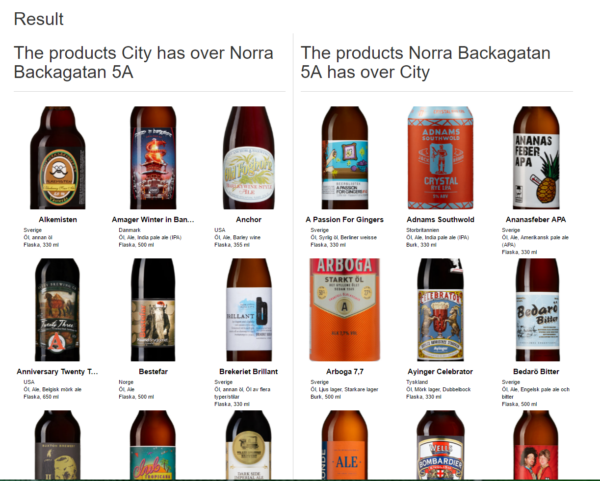

# compare-assortment
Compares the assortment between two Systembolaget stores.

# Dependencies
Flask, Requests

# How to Use
Run compare.py and navigate to localhost:5000.

Choose two different stores and press compare, the different collections will then be shown

# Example

